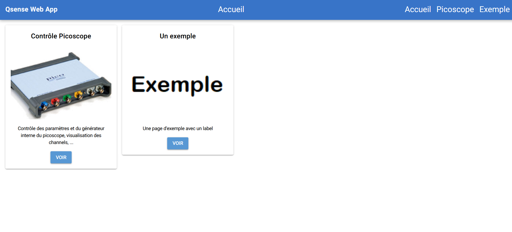
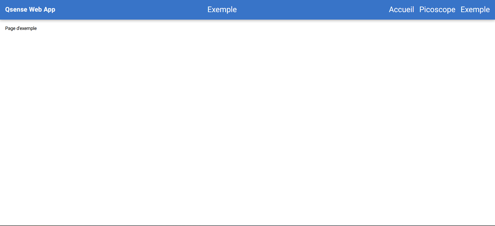

# Ajouter une page
## Contenu de la page
Pour rajouter une page, on commence par créer un fichier \<nom page\>.py dans /app/pages/. Par exemple, /app/pages/example.py :
```bash
────Web App
    │   main.py
    │
    └───app
        │   menu.py
        │   theme.py
        │
        ├───pages
        │   │   example.py
        │   │   home.py
        │   │   pico_ui.py
        │   │
        │   └───subscripts
        │           pico.py
        │
        └───resources
                pico.png
```
Le fichier \<nom page\>.py doit alors être de la forme : (par exemple pour example.py)
```python
#
# Description de la page
#

from ..theme import frame
from nicegui import ui

def create_example_page():
    @ui.page('/example') 
    def example_page():
        with frame("Exemple") :
            #
            # Contenu de la page
            #
            ui.label("Page d'exemple")
```
On y définit `create_example_page()`, qui sera importée puis appelée par `main.py` lors du lancement de l'UI.  
La directive `@ui.page('/example')` permet d'indiquer à l'UI que la fonction suivante ( `example_page()` ) n'est à exécuter que lorsque l'utilisateur se connecte sur l'URL `/example`.  
On rajoute ensuite le thème global à la page (header avec le nom de l'app/menu/titre de page, footer, ...) en important `frame` de `theme.py` ; on indique en argument le titre de page à afficher dans le header, ici, `"Exemple"`.  
  
On peut enfin rajouter le contenu de la page, ici, un simple label "Page d'exemple".

### Note :
Si la page nécessite d'établir une connexion à des éléments matériels, celle ci ne sera établie que pour une session de la page, et donc un seul utilisateur. Il faut penser à déconnecter les appareils lorsque l'utilisateur se déconnecte (i.e. ferme la page) (Sinon, la connexion restera établie tant que l'UI ne sera pas redémarrée, et tous les utilisateurs se connectant après le premier n'y auront pas accès). Pour cela, il faut importer `nicegui.app` et passer une fonction à `app.on_disconnect`. Par exemple :
```python
from ..theme import frame
from nicegui import ui, app

def create_example_page():
    @ui.page('/example') 
    def example_page():
        with frame("Exemple") :
            #
            # Contenu de la page
            #
            ui.label("Page d'exemple")

            def on_disconnect():
                # On déconnecte tous les appareils
                # Par exemple :
                pico.stop()
                pico.close()
            # Que l'on passe à app :
            app.on_disconnect(on_disconnect)
```
Ici, on définit la fonction `on_disconnect`, qui permet de fermer la connexion au picoscope, que l'on passe ensuite à `app.on_disconnect`

## Mise à jour de main et menu
Une fois la page créée, il faut mettre à jour `main.py` pour qu'il prenne en compte la nouvelle page ; pour cela, on importe la fonction `create_example_page()` créée précédemment, et on l'exécute. Par exemple :
```python
from nicegui import ui, app
from app.pages.home import create_home_page
from app.pages.pico_ui import create_pico_ui
from app.pages.example import create_example_page
import os
```
et :
```python
create_home_page() 

create_pico_ui() 
create_example_page()

ui.run()
```
  
Pour que l'on puisse accéder à la page depuis le menu, il faut rajouter un lien dans `menu.py`, redirigeant vers l'URL renseignée plus tôt dans `@ui.page("/example")`, par exemple (en gardant la même mise en forme):

```python
from nicegui import ui

def menu():
    ui.link('Accueil', '/').classes(replace='text-white text-h5')
    ui.link('Picoscope', '/pico').classes(replace='text-white text-h5')
    ui.link('Exemple', '/example').classes(replace='text-white text-h5')
```
  
## Mise à jour de la page d'accueil
  
  Pour que la page soit accessible depuis la page d'accueil, il faut rajouter une "carte" correspondante dans `home.py`. On commence par rajouter une image correspondante dans `resources/` (ici, par exemple, `example.png`), puis l'on modifie `home.py` :
  ```python
            with frame('Accueil'):
                with ui.row():
                    with ui.card():
                        with ui.column().classes("items-center"): 
                            ui.label('Contrôle Picoscope').classes('text-h6')
                            ui.separator()
                            ui.image('/resources/pico.png') 
                            ui.label('Contrôle des paramètres et du générateur interne du picoscope, visualisation des channels, ...').classes('text-center').style("width:300px")
                            pico_button = ui.button("Voir", on_click=button_handler)
                    #Nouvelle carte
                    with ui.card():
                        with ui.column().classes("items-center"):
                            ui.label("Un exemple").classes('text-h6') # Titre de la carte
                            ui.separator()
                            ui.image('/resources/example.png')
                            ui.label("Une page d'exemple avec un label").classes('text-center').style("width:300px") # Description de la carte
                            example_button = ui.button("Voir", on_click=button_handler)
  ```

  La carte contient alors un titre, une image, une description (dont la largeur est limitée à 300px pour délimiter la carte) et un bouton pour y accéder.  
  La fonction `button_handler` définie plus tôt dans `home.py` permet d'identifier le bouton d'où provient le click, et de rediriger vers la page correspondante ; pour que la redirection se fasse, il faut d'abord attribuer un nom au bouton (ici `example_button`), pour pouvoir avoir accès à son id via `example_button.id`, puis modifier le dictionnaire `list_cards` plus bas :
  ```python
list_cards = {
            pico_button.id : '/pico',
            example_button.id : '/example'
        }
  ```

  Ainsi, lorsqu'un bouton est appuyé, `button_handler()` est appelée. Cette fonction récupère alors l'ID du bouton via `e.sender.id` et cherche dans `list_cards` le lien correspondant, avant d'ouvrir ce dernier pour l'utilisateur via `e.client.open` 

  ## Résultat
  Une fois ces changements appliqués, on observe, sur la page d'accueil :
  
  Et, en cliquant sur l'un des liens vers la page d'exemple :
  
